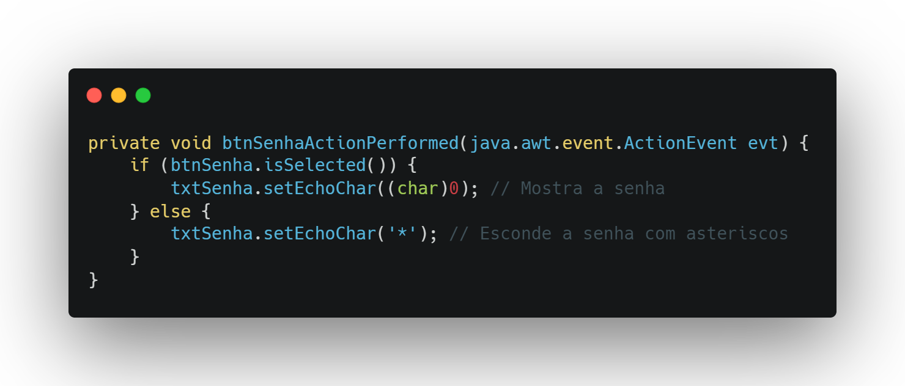
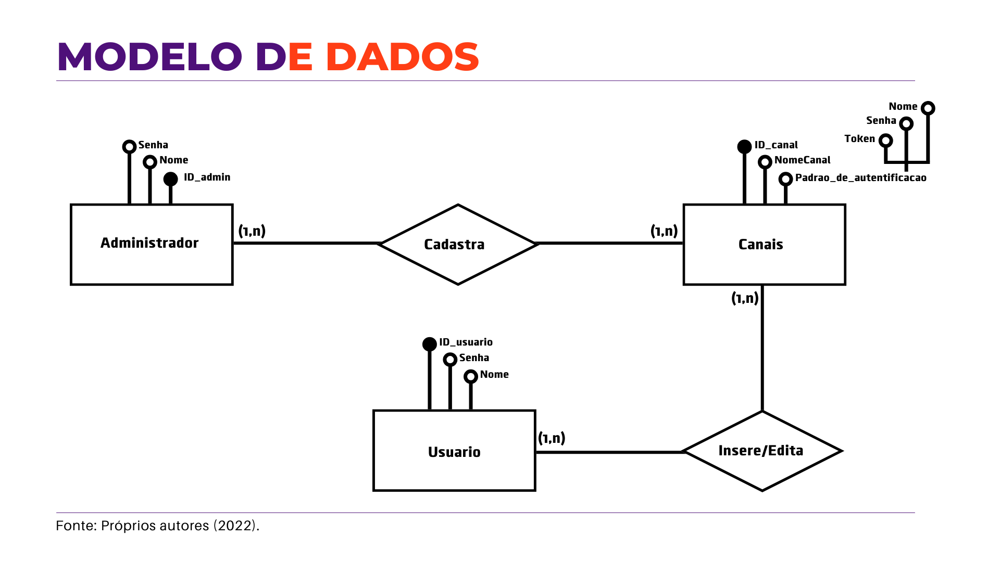
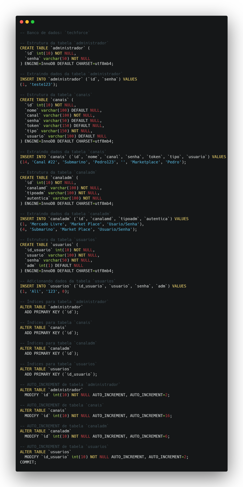

# Ali Mohamed Khodr

  

**Introdução**  
Me chamo Ali, tenho 21 anos e sou um desenvolvedor de software com foco em entregar soluções eficientes e bem estruturadas. Atualmente, estou no 5º semestre do curso tecnólogo em Banco de Dados na Faculdade de Tecnologia de São José dos Campos (FATEC) e sou formado como Técnico em Desenvolvimento de Sistemas pela Escola Técnica Estadual (ETEC) da mesma cidade.

Atualmente, sou estagiário de tecnologia na Quero Educação, onde atuo como estagiário de desenvolvedor full stack. No meu dia a dia, trabalho com tecnologias como Vue.js no frontend, Ruby e Elixir no backend, utilizando PostgreSQL como banco de dados principal. Também tenho familiaridade com infraestrutura em nuvem, especialmente com serviços da AWS.

Antes disso, atuei como estagiário de tecnologia na APTIV, unidade de Jambeiro, uma multinacional do setor automotivo. Lá, desenvolvi aplicações utilizando ASP.NET Web Forms em Visual Basic e C#, sistemas desktop com Windows Forms, além de trabalhar com SQL Server para gerenciamento de dados.

 

## Contatos
* [Github](https://www.github.com/alimkhodr)
* [LinkedIn](https://www.linkedin.com/in/alimohamedkhodr/)

## Meus Principais Conhecimentos
Tenho experiência com desenvolvimento frontend, utilizando Vue.js, JavaScript, TypeScript, HTML e CSS para criação de interfaces responsivas e funcionais. No desenvolvimento backend, trabalho com Ruby, Elixir e Node.js, além de já ter desenvolvido aplicações com ASP.NET Web Forms em Visual Basic e C#.

Possuo conhecimento em bancos de dados relacionais, especialmente PostgreSQL e Microsoft SQL Server, com experiência em modelagem, criação de consultas e manutenção de dados. Também já utilizei MySQL em projetos menores.

No ambiente desktop, desenvolvi aplicações utilizando Windows Forms, tanto em C# quanto em Visual Basic.

Tenho familiaridade com metodologias ágeis, como o Scrum, e experiência prática em versionamento de código com Git, integração de APIs REST e aplicação de boas práticas de desenvolvimento, visando código limpo, reutilizável e bem estruturado.

Além disso, tenho noções de infraestrutura em nuvem, com experiência básica em serviços da AWS, e conhecimentos iniciais em Docker, contribuindo para ambientes de desenvolvimento mais organizados e escaláveis.

## Sumário
- [Ali Mohamed Khodr](#ali-mohamed-khodr)
  - [Contatos](#contatos)
  - [Meus Principais Conhecimentos](#meus-principais-conhecimentos)
  - [Sumário](#sumário)
  - [Meus Projetos](#meus-projetos)
    - [Em 2022-1 (ADS)](#em-2022-1-ads)
      - [Empresa Parceira](#empresa-parceira)
      - [Problema](#problema)
      - [Solução Entregue](#solução-entregue)
      - [Tecnologias Utilizadas](#tecnologias-utilizadas)
    - [Em 2022-2 (ADS)](#em-2022-2-ads)
      - [Empresa Parceira](#empresa-parceira-1)
      - [Problema](#problema-1)
      - [Solução Entregue](#solução-entregue-1)
      - [Tecnologias Utilizadas](#tecnologias-utilizadas-1)
      - [Contribuições Pessoais](#contribuições-pessoais)
      - [Hard Skills](#hard-skills)
      - [Soft Skills](#soft-skills)
    - [Em 2024-1 (BD)](#em-2024-1-bd)
      - [Empresa Parceira](#empresa-parceira-2)
      - [Problema](#problema-2)
      - [Solução Entregue](#solução-entregue-2)
      - [Tecnologias Utilizadas](#tecnologias-utilizadas-2)
      - [Contribuições Pessoais](#contribuições-pessoais-1)
      - [Hard Skills](#hard-skills-1)
      - [Soft Skills](#soft-skills-1)
    - [Em 2024-2 (BD)](#em-2024-2-bd)
      - [Empresa Parceira](#empresa-parceira-3)
      - [Problema](#problema-3)
      - [Solução Entregue](#solução-entregue-3)
      - [Tecnologias Utilizadas](#tecnologias-utilizadas-3)
      - [Contribuições Pessoais](#contribuições-pessoais-2)
      - [Hard Skills](#hard-skills-2)
      - [Soft Skills](#soft-skills-2)
    - [Em 2025-1 (BD)](#em-2025-1-bd)
      - [Empresa Parceira](#empresa-parceira-4)
      - [Problema](#problema-4)
      - [Solução Entregue](#solução-entregue-4)
      - [Tecnologias Utilizadas](#tecnologias-utilizadas-4)
        - [🖥️ Frontend](#️-frontend)
        - [⚙️ Backend](#️-backend)
        - [📊 ETL (Extract, Transform, Load)](#-etl-extract-transform-load)
      - [Contribuições Pessoais](#contribuições-pessoais-3)
      - [Hard Skills](#hard-skills-3)
      - [Soft Skills](#soft-skills-3)

## Meus Projetos

### Em 2022-1 (ADS)

#### Empresa Parceira 
Neste projeto, o cliente foi a própria FATEC São José dos Campos, com foco em um sistema para apoio a estudantes e profissionais da área de tecnologia.

#### Problema
A coordenação da FATEC identificou a dificuldade dos alunos em encontrar oportunidades de trabalho adequadas ao seu perfil, especialmente na área de TI. As vagas estavam dispersas em múltiplas plataformas, sem organização centralizada, dificultando o acompanhamento por parte dos alunos e da instituição. Além disso, não havia uma forma eficiente de mapear as competências exigidas pelo mercado em relação às formações ofertadas, limitando a análise estratégica por parte dos coordenadores de curso.

#### Solução Entregue
Foi desenvolvido um Sistema Web com o objetivo de automatizar a catalogação de vagas de emprego, com ênfase na área de Tecnologia da Informação. O sistema permite a consulta e o registro de vagas organizadas por tipos de conhecimento, habilidades técnicas, competências comportamentais e requisitos exigidos pelo mercado.
A aplicação foi estruturada em cinco páginas principais, conforme os requisitos da FATEC:

- Página Principal do Projeto
- Vagas de Emprego
- Cursos e Certificações
- Métricas (conhecimentos, habilidades e requisitos)
- Localização (visualização geográfica de vagas e cursos)

#### Tecnologias Utilizadas  
- **Python**: Linguagem para desenvolvimento da aplicação.
- **HTML e CSS**: Para construção das páginas.
- **Framework Bootstrap**: Para facilitar a responsividade e o design moderno

### Em 2022-2 (ADS)

#### Empresa Parceira 
A TrackCash é uma solução B2B voltada para a conciliação de vendas e pagamentos de diferentes canais, como e-commerces, marketplaces e lojas físicas. A plataforma centraliza todas essas informações em um único painel, permitindo que empresas tenham uma visão clara e estratégica de seus dados financeiros. O foco é desenvolver uma aplicação desktop que permita aos clientes da TrackCash (lojistas físicos e online) autorizar o acesso aos seus dados de vendas e pagamentos, de forma segura e centralizada, viabilizando a conciliação financeira automática entre múltiplos canais de venda.

#### Problema
A empresa TrackCash enfrentava a necessidade de oferecer aos seus clientes — vendedores de lojas online e físicas — uma maneira prática e segura de conceder acesso às informações de suas plataformas de vendas para viabilizar o processo de conciliação financeira automatizada.

Muitos desses clientes utilizavam diferentes canais de venda (como marketplaces, e-commerces próprios e lojas físicas), o que tornava difícil consolidar dados de transações, pagamentos e recebíveis em um único sistema. Além disso, a falta de uma interface dedicada dificultava a integração entre os sistemas dos clientes e a plataforma da TrackCash, tornando o processo de autorização lento, descentralizado e propenso a erros.

#### Solução Entregue
Criar uma aplicação Desktop para que a empresa TrackCash possa atender a demanda dos seus clientes que são vendedores de lojas onlines e fisicas, para que assim possam realizar o processo de conciliação finaceira. Criaremos uma aplicação onde os clientes deem autorização por meio de email/senha ou tokens para que os sistemas da TrackCash possam ter acesso a determinadas configurações com esses recursos:

- Criar novo tipo de canal
  - Função que adiciona canais no sistema, todos os usuários podem adicionar novos canais
- Visualizar e pesquisar canais
  - Visualização dos canais do sistema, todos os usuários podem visuaizar os canais
- Editar/Deletar canais
  - Função de editar ou excluir canais do sistema, e somente o administrador pode utilizar está função

#### Tecnologias Utilizadas  
- **Java**: Linguagem para desenvolvimento da aplicação para front-end e back-end.
- **MySQL**: SGBD para desenvolvimento do Banco de Dados.
- **Netbeans**: IDE utilizada para a programação da aplicação.
- **Canva**: Site utilizado para a prototipação e desenvolvimento da apresentação.

#### Contribuições Pessoais  
- Como parte do Scrum Team, fui responsável pela criação e prototipação da aplicação, e avancei nos estudos de UX/UI. Além disso, fui responsável pelo do modelo de dados da aplicação, criação de telas utilizando JAVA e o GUI Builder do Netbeans. Sendo as atividades desempenhadas:

  
Interface Gráfica da Aplicação

  Toda a parte visual da aplicação foi desenvolvida utilizando o **GUI Builder do NetBeans**, que facilitou a construção da interface gráfica de forma visual e produtiva.  
  Foram criados e alinhados elementos como **TextBox**, **ComboBox**, **botões**, **painéis** e **logos**, com atenção à **padronização das cores** e **coerência visual** do sistema, garantindo uma experiência agradável e consistente para o usuário.

  

  
Função de visualizar a senha

  Um pequeno código somente para a vizualização da senha, ultilizado para saber se está digitando a senha correta.

  
  

  
Editar/Deletar canais

Função de editar ou excluir canais do sistema, e somente o administrador pode utilizar está função

  

  
Modelo de Dados

O modelo de dados (MD) é importante para a organização do banco de dados da aplicação, ela é feita antes da criação do banco para dar mais clareza do que será preciso no banco para a aplicação.

  

  
Banco de dados MySql

Banco de dados da aplicação, neste código foi feita criação da tabela do administrador, dos canais, doas canais do administrador, dos usuários, definição da chave primaria e outras modificações

  

#### Hard Skills  

  
Clique para ver a lista de hard skills

   
  <table align="center">
    <tr>
      <th width="300px">Tecnologia/Metodologia</th>
      <th width="300px">Classificação</th>
    </tr>
    <tr>
      <td>Java</td>
      <td>★★★★★★★☆☆☆</td>
    </tr>
    <tr>
      <td>Front-end</td>
      <td>★★★★★★★★☆☆</td>
    </tr>
    <tr>
      <td>Modelagem de Banco de Dados</td>
      <td>★★★★★★★★☆☆</td>
    </tr>
    <tr>
      <td>MySQL</td>
      <td>★★★★★☆☆☆☆☆</td>
    </tr>
    <tr>
      <td>Canva</td>
      <td>★★★★★★★★★★</td>
    </tr>
    <tr>
      <td>Scrum - Dev Team</td>
      <td>★★★★★★★☆☆☆</td>
    </tr>
    <tr>
      <td>UX/UI design</td>
      <td>★★★★★★★★★☆</td>
    </tr>
  </table>

#### Soft Skills  

Clique para ver a lista de soft skills

   
  <table align="center">
    <tr>
      <th width="300px">Habilidade</th>
      <th width="300px">Classificação</th>
    </tr>
    <tr>
      <td>Proatividade</td>
      <td>★★★★★★☆☆☆☆</td>
    </tr>
    <tr>
      <td>Visão de Negócio</td>
      <td>★★★★★★☆☆☆☆</td>
    </tr>
    <tr>
      <td>Comunicação Assertiva</td>
      <td>★★★★★★★★☆☆</td>
    </tr>
    <tr>
      <td>Empatia</td>
      <td>★★★★★★☆☆☆☆</td>
    </tr>
    <tr>
      <td>Inteligência Emocional</td>
      <td>★★★★★★☆☆☆☆</td>
    </tr>
    <tr>
      <td>Organização e Planejamento</td>
      <td>★★★★★★★★★☆</td>
    </tr>
    <tr>
      <td>Resiliência</td>
      <td>★★★★★★★★☆☆</td>
    </tr>
  </table>

### Em 2024-1 (BD)

#### Empresa Parceira 
A TrackCash é uma solução B2B voltada para a conciliação de vendas e pagamentos de diferentes canais, como e-commerces, marketplaces e lojas físicas. A plataforma centraliza todas essas informações em um único painel, permitindo que empresas tenham uma visão clara e estratégica de seus dados financeiros. O foco é desenvolver uma aplicação desktop que permita aos clientes da TrackCash (lojistas físicos e online) autorizar o acesso aos seus dados de vendas e pagamentos, de forma segura e centralizada, viabilizando a conciliação financeira automática entre múltiplos canais de venda.

#### Problema
A empresa TrackCash enfrentava a necessidade de oferecer aos seus clientes — vendedores de lojas online e físicas — uma maneira prática e segura de conceder acesso às informações de suas plataformas de vendas para viabilizar o processo de conciliação financeira automatizada.

Muitos desses clientes utilizavam diferentes canais de venda (como marketplaces, e-commerces próprios e lojas físicas), o que tornava difícil consolidar dados de transações, pagamentos e recebíveis em um único sistema. Além disso, a falta de uma interface dedicada dificultava a integração entre os sistemas dos clientes e a plataforma da TrackCash, tornando o processo de autorização lento, descentralizado e propenso a erros.

#### Solução Entregue
Criar uma aplicação Desktop para que a empresa TrackCash possa atender a demanda dos seus clientes que são vendedores de lojas onlines e fisicas, para que assim possam realizar o processo de conciliação finaceira. Criaremos uma aplicação onde os clientes deem autorização por meio de email/senha ou tokens para que os sistemas da TrackCash possam ter acesso a determinadas configurações com esses recursos:

- Criar novo tipo de canal
  - Função que adiciona canais no sistema, todos os usuários podem adicionar novos canais
- Visualizar e pesquisar canais
  - Visualização dos canais do sistema, todos os usuários podem visuaizar os canais
- Editar/Deletar canais
  - Função de editar ou excluir canais do sistema, e somente o administrador pode utilizar está função

#### Tecnologias Utilizadas  
- **Java**: Linguagem para desenvolvimento da aplicação para front-end e back-end.
- **MySQL**: SGBD para desenvolvimento do Banco de Dados.
- **Netbeans**: IDE utilizada para a programação da aplicação.
- **Canva**: Site utilizado para a prototipação e desenvolvimento da apresentação.

#### Contribuições Pessoais  
- Como parte do Scrum Team, fui responsável pela criação e prototipação da aplicação, e avancei nos estudos de UX/UI. Além disso, fui responsável pelo do modelo de dados da aplicação, criação de telas utilizando JAVA e o GUI Builder do Netbeans. Sendo as atividades desempenhadas:

  
Interface Gráfica da Aplicação

  Toda a parte visual da aplicação foi desenvolvida utilizando o **GUI Builder do NetBeans**, que facilitou a construção da interface gráfica de forma visual e produtiva.  
  Foram criados e alinhados elementos como **TextBox**, **ComboBox**, **botões**, **painéis** e **logos**, com atenção à **padronização das cores** e **coerência visual** do sistema, garantindo uma experiência agradável e consistente para o usuário.

  

  
Função de visualizar a senha

  Um pequeno código somente para a vizualização da senha, ultilizado para saber se está digitando a senha correta.

  
  

  
Editar/Deletar canais

Função de editar ou excluir canais do sistema, e somente o administrador pode utilizar está função

  

  
Modelo de Dados

O modelo de dados (MD) é importante para a organização do banco de dados da aplicação, ela é feita antes da criação do banco para dar mais clareza do que será preciso no banco para a aplicação.

  

  
Banco de dados MySql

Banco de dados da aplicação, neste código foi feita criação da tabela do administrador, dos canais, doas canais do administrador, dos usuários, definição da chave primaria e outras modificações

  

#### Hard Skills  

  
Clique para ver a lista de hard skills

   
  <table align="center">
    <tr>
      <th width="300px">Tecnologia/Metodologia</th>
      <th width="300px">Classificação</th>
    </tr>
    <tr>
      <td>Java</td>
      <td>★★★★★★★☆☆☆</td>
    </tr>
    <tr>
      <td>Front-end</td>
      <td>★★★★★★★★☆☆</td>
    </tr>
    <tr>
      <td>Modelagem de Banco de Dados</td>
      <td>★★★★★★★★☆☆</td>
    </tr>
    <tr>
      <td>MySQL</td>
      <td>★★★★★☆☆☆☆☆</td>
    </tr>
    <tr>
      <td>Canva</td>
      <td>★★★★★★★★★★</td>
    </tr>
    <tr>
      <td>Scrum - Dev Team</td>
      <td>★★★★★★★☆☆☆</td>
    </tr>
    <tr>
      <td>UX/UI design</td>
      <td>★★★★★★★★★☆</td>
    </tr>
  </table>

#### Soft Skills  

Clique para ver a lista de soft skills

   
  <table align="center">
    <tr>
      <th width="300px">Habilidade</th>
      <th width="300px">Classificação</th>
    </tr>
    <tr>
      <td>Proatividade</td>
      <td>★★★★★★☆☆☆☆</td>
    </tr>
    <tr>
      <td>Visão de Negócio</td>
      <td>★★★★★★☆☆☆☆</td>
    </tr>
    <tr>
      <td>Comunicação Assertiva</td>
      <td>★★★★★★★★☆☆</td>
    </tr>
    <tr>
      <td>Empatia</td>
      <td>★★★★★★☆☆☆☆</td>
    </tr>
    <tr>
      <td>Inteligência Emocional</td>
      <td>★★★★★★☆☆☆☆</td>
    </tr>
    <tr>
      <td>Organização e Planejamento</td>
      <td>★★★★★★★★★☆</td>
    </tr>
    <tr>
      <td>Resiliência</td>
      <td>★★★★★★★★☆☆</td>
    </tr>
  </table>

### Em 2024-2 (BD)

#### Empresa Parceira 
A ITO1 é empresa de serviços e soluções de tecnologia da informação, visando produtividade comprovada e segurança para nossos clientes, além de mitigar e até mesmo eliminar ciberataques, proporcionando uma estrutura de rede segura com alta performance.

#### Problema
A empresa enfrenta o desafio de armazenar e consultar dados de geolocalização em tempo real, gerados continuamente por dispositivos de IoT, como wearables, tags e smartphones. Esses dados são essenciais para o monitoramento de pessoas e ativos, exigindo um sistema que possa gerenciar grandes volumes de informações de forma escalável, confiável e segura.

#### Solução Entregue
Para superar esses obstáculos, propomos desenvolver uma solução que automatize o gerenciamento e a configuração de dados de geolocalização. Essa solução permitirá à empresa agilizar a implantação das operações, garantindo a integridade, a consistência e a segurança das informações, reduzindo a necessidade de intervenção de técnicos especializados. Como resultado, a empresa otimizará o monitoramento e o rastreamento em tempo real, tornando as operações mais ágeis e eficientes. Tendo esses recursos:

- Interação com o Mapa
- Filtrar resultados por pessoa usando uma lista suspensa para ver dispositivos.
- Filtrar resultados por intervalo de tempo usando um calendário.
- Visualização de Localizações no Mapa: Funcionalidade: Mostrar pontos de localização (paradas) com pinos no mapa.
- Pesquisas Rápidas: Usar tags como "Hoje", "Últimos 3 dias", "Esta semana" e "Último mês" para pesquisas rápidas.
- Gerenciamento de Seções Geográficas: Criar, visualizar e excluir seções geográficas usando formas geométricas para buscas e filtros.
- Visualização de Relatórios Detalhados: Ver relatórios detalhados em pop-ups sobre informações no mapa.
- Acesso ao Sistema: Login com usuário e senha, incluindo autenticação segura.
- Traçado de Rotas no Mapa: Traçar rotas de pessoas ou objetos no mapa com base em filtros
- Pesquisa por Seções Geográficas: Pesquisar por seções geográficas pré-cadastradas para ver dispositivos IoT na área.

#### Tecnologias Utilizadas  
- **Java**: Linguagem para desenvolvimento da aplicação backend.
- **Spring Boot**:  Desenvolvimento da aplicação backend.
- **Vue**: Linguagem para desenvolvimento da aplicação frontend.
- **Oracle**: Banco de dados.
- **Google Maps**: Biblioteca utilizada para renderizar o mapa.
- **Vuetify**: Biblioteca de UI/UX.

#### Contribuições Pessoais  
- Como parte do Scrum Team, fui responsável pela configuração do Google Maps e do Vuetify no projeto além de implementar as funcionalidades de Filtrar resultados por pessoa, Filtrar resultados por intervalo de tempo e por fim modelagem

  
Interface Gráfica da Aplicação

  Toda a parte visual da aplicação foi desenvolvida utilizando o **GUI Builder do NetBeans**, que facilitou a construção da interface gráfica de forma visual e produtiva.  
  Foram criados e alinhados elementos como **TextBox**, **ComboBox**, **botões**, **painéis** e **logos**, com atenção à **padronização das cores** e **coerência visual** do sistema, garantindo uma experiência agradável e consistente para o usuário.

  

  
Função de visualizar a senha

  Um pequeno código somente para a vizualização da senha, ultilizado para saber se está digitando a senha correta.

  
  

  
Editar/Deletar canais

Função de editar ou excluir canais do sistema, e somente o administrador pode utilizar está função

  

  
Modelo de Dados

O modelo de dados (MD) é importante para a organização do banco de dados da aplicação, ela é feita antes da criação do banco para dar mais clareza do que será preciso no banco para a aplicação.

  

  
Banco de dados MySql

Banco de dados da aplicação, neste código foi feita criação da tabela do administrador, dos canais, doas canais do administrador, dos usuários, definição da chave primaria e outras modificações

  

#### Hard Skills  

  
Clique para ver a lista de hard skills

   
  <table align="center">
    <tr>
      <th width="300px">Tecnologia/Metodologia</th>
      <th width="300px">Classificação</th>
    </tr>
    <tr>
      <td>Java</td>
      <td>★★★★★★★☆☆☆</td>
    </tr>
    <tr>
      <td>Front-end</td>
      <td>★★★★★★★★☆☆</td>
    </tr>
    <tr>
      <td>Modelagem de Banco de Dados</td>
      <td>★★★★★★★★☆☆</td>
    </tr>
    <tr>
      <td>MySQL</td>
      <td>★★★★★☆☆☆☆☆</td>
    </tr>
    <tr>
      <td>Canva</td>
      <td>★★★★★★★★★★</td>
    </tr>
    <tr>
      <td>Scrum - Dev Team</td>
      <td>★★★★★★★☆☆☆</td>
    </tr>
    <tr>
      <td>UX/UI design</td>
      <td>★★★★★★★★★☆</td>
    </tr>
  </table>

#### Soft Skills  

Clique para ver a lista de soft skills

   
  <table align="center">
    <tr>
      <th width="300px">Habilidade</th>
      <th width="300px">Classificação</th>
    </tr>
    <tr>
      <td>Proatividade</td>
      <td>★★★★★★☆☆☆☆</td>
    </tr>
    <tr>
      <td>Visão de Negócio</td>
      <td>★★★★★★☆☆☆☆</td>
    </tr>
    <tr>
      <td>Comunicação Assertiva</td>
      <td>★★★★★★★★☆☆</td>
    </tr>
    <tr>
      <td>Empatia</td>
      <td>★★★★★★☆☆☆☆</td>
    </tr>
    <tr>
      <td>Inteligência Emocional</td>
      <td>★★★★★★☆☆☆☆</td>
    </tr>
    <tr>
      <td>Organização e Planejamento</td>
      <td>★★★★★★★★★☆</td>
    </tr>
    <tr>
      <td>Resiliência</td>
      <td>★★★★★★★★☆☆</td>
    </tr>
  </table>

### Em 2025-1 (BD)

#### Empresa Parceira 
A Youtan é uma empresa de Desenvolvimento de Sistemas / Software Web e Desenvolvimento de Apps / Mobile

#### Problema
Equipes de desenvolvimento enfrentam dificuldades para:
- Ter visibilidade clara da performance dos projetos
- Identificar gargalos e padrões nos processos
- Tomar decisões baseadas em dados concretos
- Centralizar informações de diferentes ferramentas de gestão

#### Solução Entregue
Desenvolver uma plataforma de gerenciamento e monitoramento de desempenho de projetos focada em fornecer visibilidade e insights dinâmicos sobre métricas e indicadores. A plataforma será integrada ao Taiga e permitirá a visualização de dados como número de cartões criados e concluídos, tempo médio de execução, distribuição por funcionário, entre outros indicadores relevantes. Com diferentes níveis de acesso (Operador, Gerente e Administrador), o sistema terá esses recursos:

- Dashboard interativo com métricas em tempo real
- Visualização de cards por tag, colaborador e status
- Análise de tempo médio de execução e retrabalhos
- Controle de acesso baseado em roles
- Exportação de dados em formato CSV
- Integração com múltiplas plataformas de gestão

#### Tecnologias Utilizadas  
##### 🖥️ Frontend
- **Nuxt 3** - Framework baseado em Vue.js
- **Vue.js** - Framework JavaScript progressivo
- **TypeScript** - Tipagem estática (opcional)
- **Tailwind CSS** - Framework de estilos utility-first
- **Node.js** - Runtime JavaScript
- **npm** - Gerenciador de pacotes
- **Vitest** - Usado para testes no frontend

##### ⚙️ Backend
- **Go (Golang)** - Linguagem de programação principal
- **PostgreSQL** - Banco de dados relacional
- **Swagger** - Documentação de API
- **GitHub Actions** - CI/CD
- **golangci-lint** - Linter para Go
- **Sqlite** - Usado para testes no backend

##### 📊 ETL (Extract, Transform, Load)
- **Python 3.10+** - Linguagem principal
- **SQLAlchemy** - ORM para Python
- **Pandas** - Manipulação e análise de dados
- **Requests** - Cliente HTTP para Python
- **psycopg2** - Conector PostgreSQL
- **pytest** - Framework de testes
- **flake8** - Linter para Python
- **python-dotenv** - Variáveis de ambiente

#### Contribuições Pessoais  
Como parte do Scrum Team, fui responsável por: 
- Setup Inicial e Infraestrutura do Frontend
- Visualização dos Projetos e Dashboards - pt1
- Dashboards e Visualização de Métricas - pt2
- Métricas e Indicadores Gerenciais
- Login com `Primeiro acesso`,`Login normal`, `Definir senha`
- DevOps: Teste de integração

  
Setup Inicial e Infraestrutura do Frontend

Criação do projeto e configuração da estrutura do frontend usando Nuxt 3, NuxtUI (Ao configurar NuxtUI Tailwind vem junto), Criação de componentes padrão como o `UText` usados para padronizar a aplicação

  
Visualização dos Projetos e Dashboards

  Inicialmente teriamos uma tela de vizualização de projetos que mandaria para o dashboard daquele projeto

  
Dashboards e Visualização de Métricas - pt2

Refatoração na Visualização de Métricas, removendo a tela de vizualização de projetos deixando somente um select de projetos e outros filtros na tela de dashboard para selecionar o projeto e aparecer os dados do projeto selecionado

  
Login

Tela de login com `Primeiro acesso` mandando um token para o email do usuário para que ele possa ir para a tela de `Definir senha` e ir para a tela de `Login normal`, nessa parte já mandamos a role do usuário para definir projetos e telas que ele tem acesso 

  
Métricas e Indicadores Gerenciais

Tela de visualização e alteração de roles dos usuários que somente administradores podem vizualizar.

  
DevOps: Teste de integração

Testes de integração no login no backend usando Sqlite para testar a integração entre o banco com o backend

#### Hard Skills  

  
Clique para ver a lista de hard skills

   
  <table align="center">
    <tr>
      <th width="300px">Tecnologia/Metodologia</th>
      <th width="300px">Classificação</th>
    </tr>
    <tr>
      <td>Front-end</td>
      <td>★★★★★★★★★☆</td>
    </tr>
    <tr>
      <td>DevOps</td>
      <td>★★★★★★☆☆☆☆</td>
    </tr>
    <tr>
      <td>Scrum - Dev Team</td>
      <td>★★★★★★★★☆☆</td>
    </tr>
    <tr>
      <td>UX/UI design</td>
      <td>★★★★★★★☆☆☆</td>
    </tr>
  </table>

#### Soft Skills  

Clique para ver a lista de soft skills

   
  <table align="center">
    <tr>
      <th width="300px">Habilidade</th>
      <th width="300px">Classificação</th>
    </tr>
    <tr>
      <td>Proatividade</td>
      <td>★★★★★★★★★</td>
    </tr>
    <tr>
      <td>Visão de Negócio</td>
      <td>★★★★★★★★☆☆</td>
    </tr>
    <tr>
      <td>Comunicação Assertiva</td>
      <td>★★★★★★★☆☆☆</td>
    </tr>
    <tr>
      <td>Empatia</td>
      <td>★★★★★★★★☆☆</td>
    </tr>
    <tr>
      <td>Inteligência Emocional</td>
      <td>★★★★★★☆☆☆☆</td>
    </tr>
    <tr>
      <td>Organização e Planejamento</td>
      <td>★★★★★★★★★☆</td>
    </tr>
    <tr>
      <td>Resiliência</td>
      <td>★★★★★★★★★☆</td>
    </tr>
  </table>

